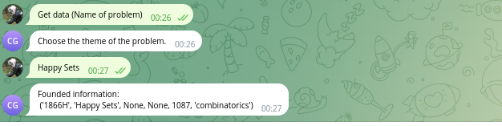

# codeforces.com parser + telegram bot
* Grabber collects data from codeforces.com to database
* Grabber check data updates on site every hour
* Telegram bot can request data from database (up to 10 values)
## Requirements
* Python
* Redis
* Postgres
## Project folders description
* [bot] - telegram bot configuration 
* [checker] - celery configuration
* [sql] - creation table query 
* [srq] - functional processing
* [tests] - pytest
* [img] - pictures for README
## Installation
* Download repo
* Install requirements (pip install -r requirements.txt)
* Run service Redis (service redis-server start)
## Prepare 
* prepare database.ini file [postgresql] - connection to database [token] - bot secret token
* create database for postgres
* prepare telegram bot (you can use default configuration @codeforces_grabber_bot)
## Start service
* run command: celery -A checker beat --loglevel=INFO
* run command: celery -A checker worker --loglevel=INFO
* run python project
* after first running and loading data from site you can work with bot
* run command /start in telegram bot
## Testing
Test make after creation databases (some test work with database)
* pytest --cov
* pytest --cov --cov-report html
pip install pytest-cov
pytest --cov=src --cov-report=html
pytest --cov
## Examples work with interface
### cli menu

### main telegram bot menu

### telegram bot menu - search by difficult and theme

### telegram bot menu - search by title

## Additional
* Author: Avramenko Nikolay
* Date of release: 2023/08/09